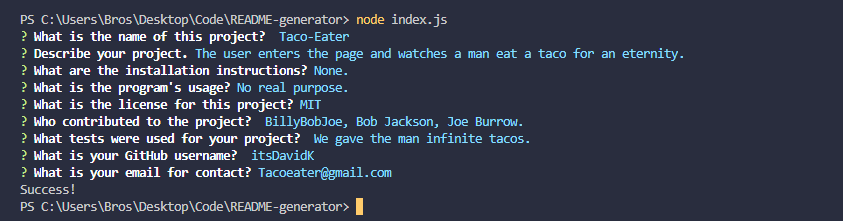

# README-generator
README-generator is a simple program that allows the user to generate a README file for their project to save time when working on a project.
Using NODE the user gets prompted questions to answer, and by the user's response the program generates the README file according the user's response.

## Contributing
Pull requests are welcome. For major changes, please open an issue first to discuss what you would like to change.

Please make sure to update tests as appropriate.

## Screenshots

## Video Showcase
https://www.youtube.com/watch?v=EramTnlWmhY
